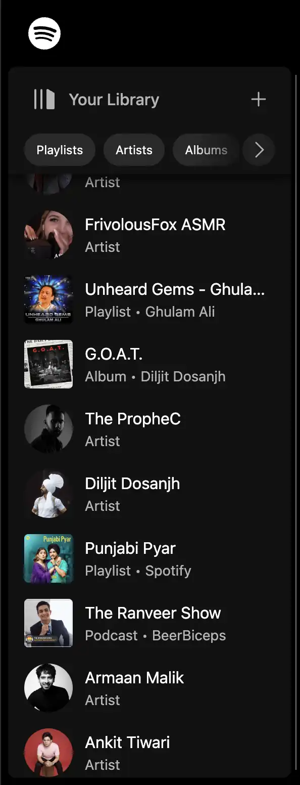
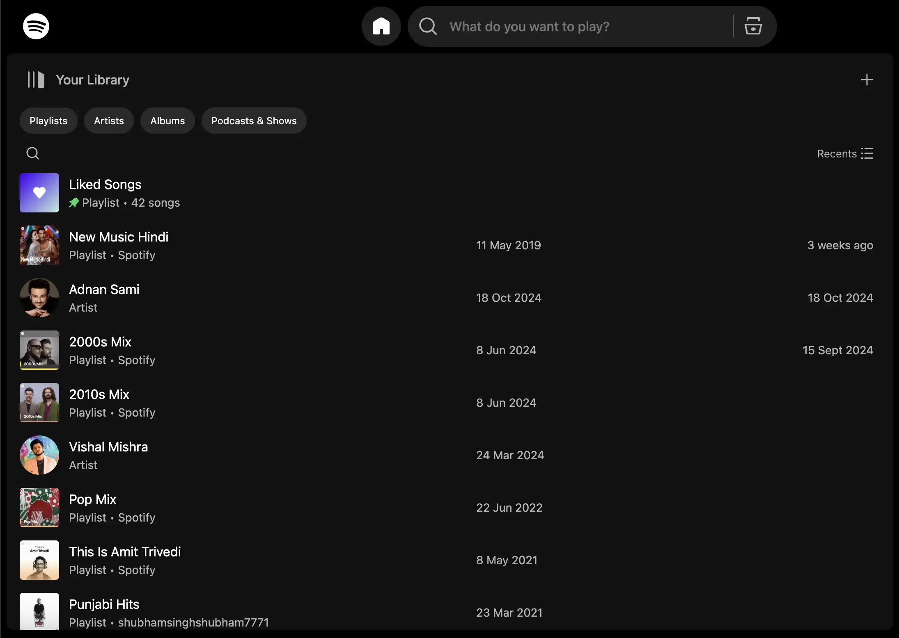

# Spotify Clone 🎧

This project is an experimentation to utilise a new Kotlin WASM/JS framework named [Kilua](https://github.com/rjaros/kilua/) that allows us to deploy our web applications with full SSR (Server Side Rendering) for better SEO performance and user experience 🚀

The app is currently deployed on [Vercel](https://vercel.com/) and utilises Kotlin/WASM and SSR to provide you with a nice and fast experience 💚

Play with it: https://spotify-clone-kilua.vercel.app/

> [!WARNING]
This project is just a developmental experimentation and is only made to appreciate the hardwork that must have went into developing the original piece of software by Spotify. Therefore, all rights to the original software belong to Spotify only.

# Demo 📺

>[!TIP]
If the video below is visible to you, then turn up the volume for a better experience 😉 🎵

https://github.com/user-attachments/assets/2ed5fa7e-49c4-4c67-902e-7095eea33d80

### Main Screen

### Sidebar

| State    | Screenshot                                              |
|----------|---------------------------------------------------------|
| Closed   |    |
| Opened   |      |
| Expanded |  |

# Build 🔧

To build the application, you need to have JDK 21 or later installed.

The following tasks are available:

- `./gradlew -t jsBrowserDevelopmentRun` - run the webpack dev server in continuous build mode for JS target on `http://localhost:3000`
- `./gradlew -t jsBrowserProductionRun` - run the webpack dev server in continuous build mode for Wasm target on `http://localhost:3000`
- `./gradlew jsBrowserDistribution` - build production application for JS target to `build/dist/js/productionExecutable` directory
- `./gradlew wasmJsBrowserDistribution` - build production application for Wasm target to `build/dist/wasmJs/productionExecutable` directory

> [!NOTE]
Use `gradlew.bat` instead of `./gradlew` on Windows operating system.

# Contribute 🤝🏻

Thank you for considering contributing to the project. All PRs are welcomed here 🙌🏼

### Like the work? Feel free to appreciate it by giving a star 🌟
